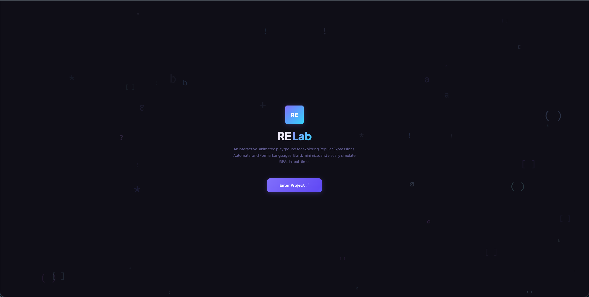
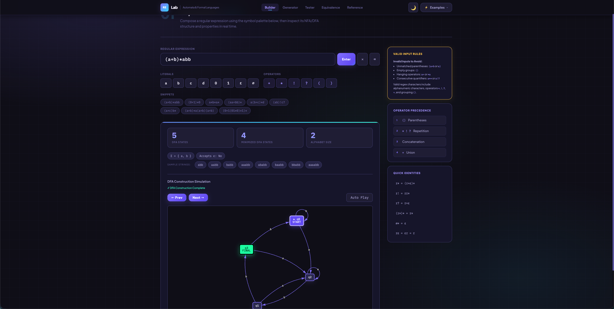

# RE Lab — Regular Expression & Automata Engine

An advanced, pedagogically focused Regular Expression analyzer that bridges the gap between formal language theory and interactive visualization. This tool implements the complete pipeline from a regex string to a minimized, simulating DFA.

## 🚀 Key Features (Beyond Basic Analysis)

While most tools handle simple generation, **RE Lab** implements the full automata lifecycle:

*   **Thompson’s NFA Transformer**: Pure implementation of Thompson's construction algorithm, converting any valid regex into a Non-deterministic Finite Automaton with $\epsilon$-transitions.
*   **Powerset DFA Construction**: Uses the $\epsilon$-closure algorithm to convert NFAs into equivalent Deterministic Finite Automata.
*   **Hopcroft’s DFA Minimization**: Automatically optimizes the resulting DFA by merging indistinguishable states, ensuring the most efficient state machine representation.
*   **Live BFS Build Simulation**: A unique "progressive" build mode that animates the subset construction process in real-time, showing how sets of NFA states coalesce into single DFA entities.
*   **Step-by-Step String Tracing**: A visual simulation system that highlights active states and transitions as a string is processed, providing a concrete view of state-machine execution.
*   **Batch Test Suite**: High-throughput validation allowing users to test entire sets of strings against a regex simultaneously.
*   **Structural Analytics**: Provides depth-of-analysis including alphabet $(\Sigma)$ detection, state count comparisons (NFA vs DFA vs Minimized DFA), and $\epsilon$-acceptance checks.

## 🛠 The Technical Pipeline

### 1. Lexical Analysis & Parsing
The engine uses a **Recursive-Descent Parser** to handle the standard operator precedence:
1.  **Grouping**: `(...)`
2.  **Repetition**: `*` (Star), `!` (Plus), `?` (Question)
3.  **Concatenation**: Implicit juxtaposition (`ab`)
4.  **Union**: `+` (Addition/Alternation)

### 2. NFA Construction
Every operator is mapped to an NFA fragment. For example, the Union operator $(r + s)$ creates a new start state that branches via $\epsilon$-transitions to the start states of $r$ and $s$, then merges their accepting states into a new final state.

### 3. DFA Conversion (Subset Construction)
The engine executes a Breadth-First Search (BFS) over the powerset of NFA states. It computes the **$\epsilon$-closure** for every reachable configuration, mapping each unique set of NFA states to a single, concrete DFA state.

### 4. Equivalence Checking
To determine if two Regular Expressions define the same language, the tool performs a **Product Automaton Traversal**. It explores the pairs of states $(q_1, q_2)$ from both DFAs. If the search reaches a pair where exactly one state is accepting, it produces a "witness" string that is accepted by one regex but not the other, proving non-equivalence.

## 📸 Project Previews

*Parallax landing screen with cursor-reactive operator particles.*

*Live DFA construction and structural analysis.*

*Step-by-step transition simulation on a generated string.*

## 📚 Notation Reference

| Notation | Meaning | Example |
| :--- | :--- | :--- |
| `a` | Literal symbol | `a` |
| `ε` | Empty string | `ε` |
| `∅` | Empty set | `∅` |
| `r + s` | Union | `a + b` |
| `r*` | Kleene star | `a*` |
| `r!` | one or more | `a!` |
| `r?` | zero or one | `a?` |

---
**Developed for Theory of Automata and Formal Languages study.**
